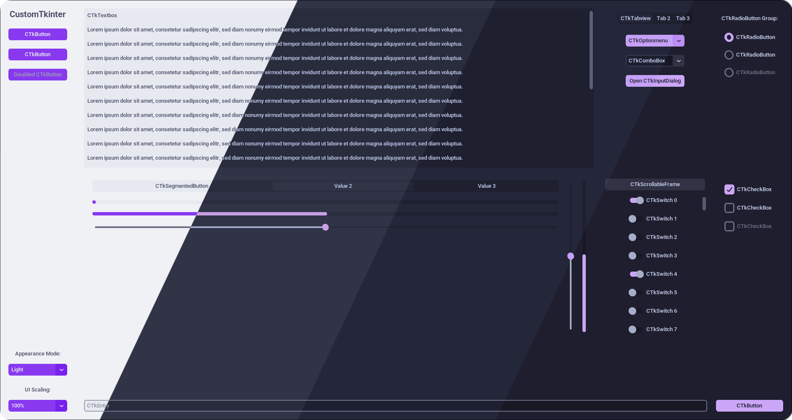
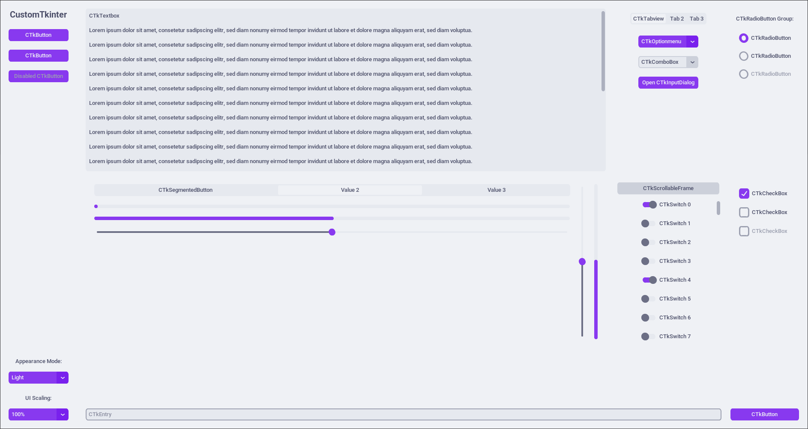
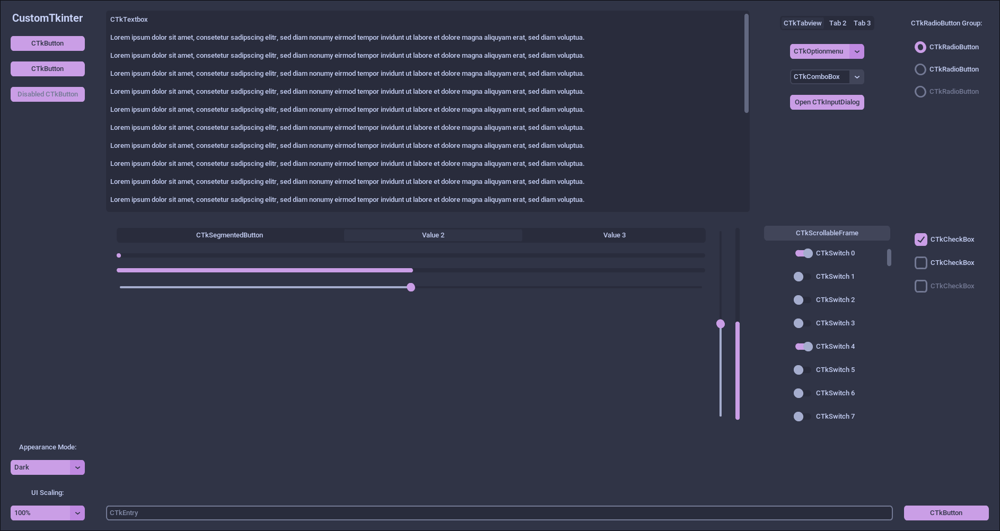
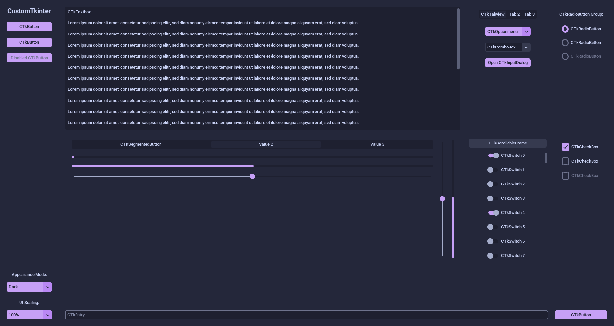
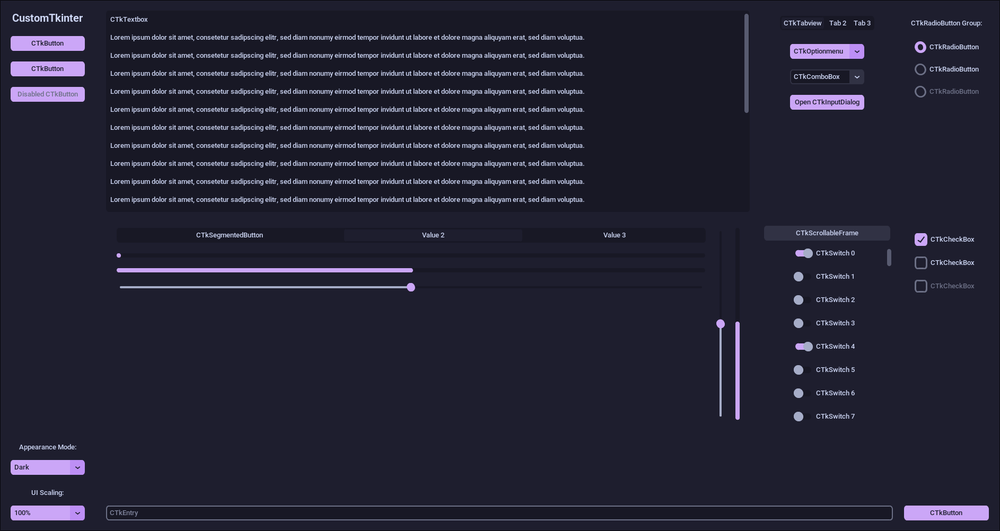

<h3 align="center">
	 
	
	Catppuccin for <a href="https://github.com/TomSchimansky/CustomTkinter">CustomTkinter</a>
	
</h3>

	
	
	

	

## Previews

🌻 Latte

🪴 Frappé

🌺 Macchiato

🌿 Mocha

## Usage

> [!NOTE]
> This port has both a dynamic and static version. The dynamic version has different flavors for the light mode while the static version uses the flavor for both the light and dark theme. The dynamic theme does have
> The theme files also modify non-color elements, such as corner radius, border width, and fonts. They are based on the built-in [blue theme](https://github.com/TomSchimansky/CustomTkinter/blob/master/customtkinter/assets/themes/blue.json). You can freely adjust the non-color elements as wanted.

1. Download the flavor of your choice from [themes](themes). The dynamic theme uses a path like so: `themes/dynamic/<dark flavor>/<light flavor>/catppuccin-<dark flavor>-<light flavor>-<accent>`.
2. In your Python file, put `customtkinter.set_default_color_theme("path/to/catppuccin-{dark flavor}-{light flavor}-{accent}.json")` (replace `path/to` with the actual path and replace `{dark flavor}` with the dark flavor you chose, `{light flavor}` with the light flavor you chose, and `{accent}` with the accent you chose).
3. Enjoy!

## 🙋 FAQ

- Q: **_"How do I change themes with dynamic mode?"_**\
  A: To use the light theme put this in your code: `ctk.set_appearance_mode("light")`. The options are **light**, **dark**, and **System**.

## 💝 Thanks to

- [Scarce Koi](https://github.com/scarcekoi)

&nbsp;

	

	Copyright &copy; 2021-present <a href="https://github.com/catppuccin" target="_blank">Catppuccin Org</a>

	

